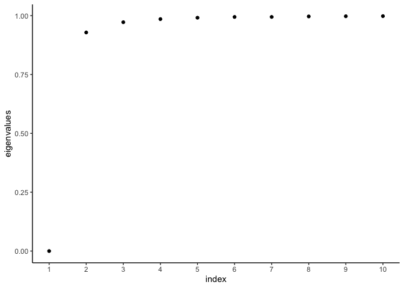
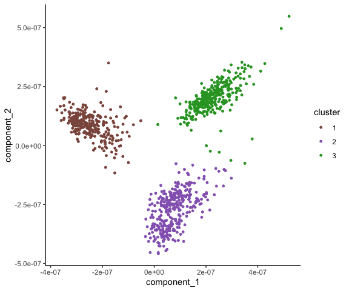
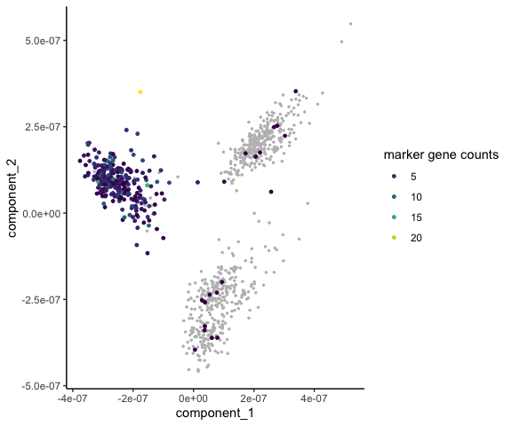
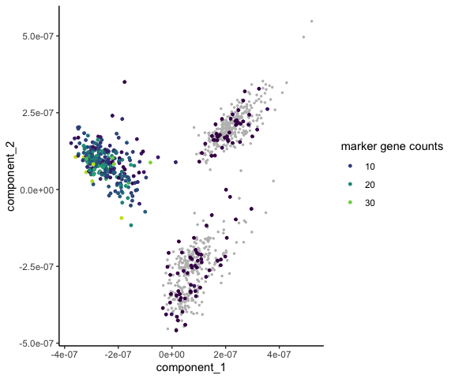

countland: R tutorial
================

### Samuel H. Church

url:
<https://github.com/shchurch/countland/blob/main/countland-R/vignettes/vignette-tutorial.Rmd>

This tutorial demonstrates the major functions of `countland` by
applying them to a Gold standard single-cell RNA sequencing dataset from
[Freytag *et al* (2018)](10.12688/f1000research.15809.2).

`countland` is a **barebones** set of functions for applying a
restricted linear algebra to the analysis of count-based data. As such,
there are many opportunities for further optimization that may prove
useful in the anlaysis of your own data. We provide the source code
freely available at <https://github.com/shchurch/countland> and
encourage users and developers to fork the code for their own purposes.

The following packages are required to complete the tutorial

``` r
library(countland)
library(Seurat) # for reading in the data
library(ggplot2)
theme_set(theme_classic())
set.seed(84095) # set random seed for reproducibility
```

## Get the data

We have used the Gold standard dataset provided by [Freytag *et al*
(2018)](10.12688/f1000research.15809.2). This data consists of \~1000
cells that have ground truth labels corresponding to three human lung
cell lines.

`countland` accepts an sparse data matrix (as does `Seurat`).

``` r
gold_path <- system.file("extdata", "Gold_Freytag2018/", package = "countland", mustWork = TRUE)
gold.data <- Seurat::Read10X(data.dir = gold_path)
m <- gold.data
```

## Initialize `countland` object

Initialize `countland` by calling the core function on sparse data
matrix.

``` r
C <- countland(m)
#> [1] "countland object"
#> [1] "after removing empty cells and genes,"
#> [1] "the count matrix has 29212 genes (rows)"
#> [1] "    and 925 cells (columns)"
#> [1] "the fraction of entries that are nonzero is 0.2905"
```

The count matrix is stored in `C@counts`

``` r
C@counts[1:10,1:10]
#> 10 x 10 sparse Matrix of class "dgCMatrix"
#>    [[ suppressing 10 column names 'H2228_AAACCTGCAGACACTT-1', 'H1975_AAAGATGCACATTTCT-1', 'H1975_AAAGATGTCCTTTACA-1' ... ]]
#>                                    
#> ENSG00000243485 . . . . . . . . . .
#> ENSG00000238009 . . . . . . . . . .
#> ENSG00000239945 . . . . . . . . . .
#> ENSG00000233750 . . . . . . . . . .
#> ENSG00000268903 . . . . . . . . . .
#> ENSG00000241860 . . . . . . . 1 . .
#> ENSG00000279457 . . . . . . . . . .
#> ENSG00000228463 . . . . . 1 . . . .
#> ENSG00000236601 . . . . . . . . . .
#> ENSG00000237094 . . . . . 2 . . . .
```

Note that most counts are zero for scRNA-seq data.

## Summarize counts across cells and genes

We can explore our data by checking the total number of counts and other
expression measures across genes. These measures include:

-   The number of cells where each gene was detected.
-   The maximum observed count value per gene.
-   The total number of counts per gene, summed across cells.
-   The number of cells where a gene was detected at a count value
    larger than 1 or 10.
-   The number of unique count values (e.g. 0, 1, 2). Given the discrete
    nature of low-magnitude count values, this measure can provide
    insight into expression variability across cells.
-   The largest number
    ,
    where there are
    
    cells with
    
    counts for the gene in question. We refer to this measure as the
    *count index*, and it can be helpful for finding genes that
    frequently show higher count values, as compared to genes that are
    mostly detected at values of 1 or 2, with a few high-count
    exceptions.

``` r
# calculate expression scores across genes
C <- ScoreGenes(C)
head(C@gene_scores)
#>             names n_cells max_count_value total_counts
#> 1 ENSG00000000003     825              26         3289
#> 2 ENSG00000000419     922              58        10379
#> 3 ENSG00000000457     226               4          278
#> 4 ENSG00000000460     446               6          805
#> 5 ENSG00000000938       2               1            2
#> 6 ENSG00000000971     321               7          565
#>   n_cells_above1 n_cells_above10 unique_count_values
#> 1            662              38                  20
#> 2            914             384                  43
#> 3             40               0                   4
#> 4            202               0                   6
#> 5              0               0                   1
#> 6            144               0                   7
#>   count_index
#> 1          13
#> 2          30
#> 3           3
#> 4           5
#> 5           1
#> 6           6
```

We can also calculate the same measures, but across cells.

It can be helpful to see how many counts are derived from certain genes,
such as mitochondrial genes. Here we chose a gene at random, its counts
are listed under `feature_match_counts`. Regular expressions are
permitted for name matching.

``` r
# sum counts from genes matching this regex expression
gene_string <- "162396$"

# calculate expression scores across cells
C <- ScoreCells(C,gene_string)
head(C@cell_scores)
#>                      names n_features max_count_value
#> 1 H1975_AAAGATGCACATTTCT-1       8574            1010
#> 2 H1975_AAAGATGTCCTTTACA-1       9190            1803
#> 3 H1975_AAATGCCCACTTCGAA-1       8433            1097
#> 4 H1975_AAATGCCTCATATCGG-1       8311            1678
#> 5 H1975_AACACGTGTCAGAAGC-1       8642            1142
#> 6 H1975_AACCATGAGCGTAGTG-1       7907            1549
#>   total_counts n_features_above1 n_features_above10
#> 1       100763              5746               1432
#> 2       121201              6316               1567
#> 3        95220              5643               1390
#> 4        99321              5556               1247
#> 5       106598              5833               1431
#> 6        90917              5058               1127
#>   unique_count_values count_index feature_match_counts
#> 1                 227         127                    0
#> 2                 245         137                    1
#> 3                 219         127                    0
#> 4                 221         131                    0
#> 5                 231         133                    0
#> 6                 214         128                    0
```

## Cluster cells by similarity

In our count-based approach, we compare cell transcriptomes by
calculating the dot product of untransformed counts between all pairwise
combinations of cells. This process generates a similarity matrix
(rather than a distance matrix, as typically used in scRNA workflows).

``` r
C <- Dot(C)
#> [1] "Calculating dot products between rows..."
#> [1] "    done."
# preview the resulting similarity matrix
C@dots[1:5,1:5]
#> 5 x 5 sparse Matrix of class "dgCMatrix"
#>                          H2228_AAACCTGCAGACACTT-1
#> H2228_AAACCTGCAGACACTT-1                 28462878
#> H1975_AAAGATGCACATTTCT-1                 20223823
#> H1975_AAAGATGTCCTTTACA-1                 28226410
#> H2228_AAAGCAACATCAGTAC-1                 34194398
#> H1975_AAATGCCCACTTCGAA-1                 19182289
#>                          H1975_AAAGATGCACATTTCT-1
#> H2228_AAACCTGCAGACACTT-1                 20223823
#> H1975_AAAGATGCACATTTCT-1                 21073555
#> H1975_AAAGATGTCCTTTACA-1                 26372201
#> H2228_AAAGCAACATCAGTAC-1                 28025133
#> H1975_AAATGCCCACTTCGAA-1                 18950157
#>                          H1975_AAAGATGTCCTTTACA-1
#> H2228_AAACCTGCAGACACTT-1                 28226410
#> H1975_AAAGATGCACATTTCT-1                 26372201
#> H1975_AAAGATGTCCTTTACA-1                 39374647
#> H2228_AAAGCAACATCAGTAC-1                 37423857
#> H1975_AAATGCCCACTTCGAA-1                 24468440
#>                          H2228_AAAGCAACATCAGTAC-1
#> H2228_AAACCTGCAGACACTT-1                 34194398
#> H1975_AAAGATGCACATTTCT-1                 28025133
#> H1975_AAAGATGTCCTTTACA-1                 37423857
#> H2228_AAAGCAACATCAGTAC-1                 48948460
#> H1975_AAATGCCCACTTCGAA-1                 26217138
#>                          H1975_AAATGCCCACTTCGAA-1
#> H2228_AAACCTGCAGACACTT-1                 19182289
#> H1975_AAAGATGCACATTTCT-1                 18950157
#> H1975_AAAGATGTCCTTTACA-1                 24468440
#> H2228_AAAGCAACATCAGTAC-1                 26217138
#> H1975_AAATGCCCACTTCGAA-1                 18299558
```

Cell similarity can then be analyzed by applying spectral embedding to
this dot product similarity matrix. Spectral embedding involves
calculating the graph Laplacian of the matrix and then estimating the
eigenvectors and eigenvalues of this graph.

``` r
C <- Embed(C)
#> [1] "Performing spectral embedding on dot products..."
#> [1] "    done."
```

This matrix can also be used to cluster cells by applying a k-means
algorithm to the eigenvector matrix (spectral clustering). In order to
determine the optimal number of clusters, it can be helpful to apply an
eigengap heuristic. This can help decide the optimal number of clusters,
but it is only a guideline. According to this heuristic, the optimal
number of clusters is *k* where the difference in eigenvalues

is largest.

``` r
PlotEigengap(C)
```

<!-- -->

Here we see big jumps between 1 and 2, and a smaller gap between 2 and
3. For many datasets, you may want to consider other factors,
e.g. choosing a minimum number of clusters, whether or not the eigengap
reflects this.

Here we have chosen 3 as the optimal number of clusters, given our prior
knowledge about this benchmark dataset.

``` r
C <- Cluster(C,n_clusters=3)
#> [1] "Performing spectral clustering on dot products..."
#> [1] "    done."
```

The clustering results are stored in `C@clusters`. The cell similarity
matrix can be visualized in two dimensions by plotting points using two
eigenvectors.

``` r
PlotEmbedding(C)
```

<!-- -->

As we see, cells fall into three clusters which separate along the first
two dimensions.

## Subsampling data

It’s not always necessary to standardize sequencing depth across cells
in order to make useful comparisons. However there are certain
comparisons where we might expect differences in sequencing depth to
obscure biological differences, for example, when calculating
differential gene expression across cells.

One method of standardizing sequencing depth is to subsample counts to
an equivalent number for all cells. Since the scRNA-seq counting process
stops at an arbitrary point, we can randomly subsample from our
observations per cell to stop the process at a specific number of our
choosing.

Here we do this with the function `Subsample()`. To subsample to the
minimum number of total counts across cells, use `cell_counts='min'`,
otherwise use a number of counts larger than the minimum value.

``` r
C <- Subsample(C,cell_counts='min')
#> [1] "subsampling all cells to a standard sequencing depth of 40152"
# preview the resulting subsampled count matrix
C@subsample[1:10,1:10]
#> 10 x 10 sparse Matrix of class "dgCMatrix"
#>    [[ suppressing 10 column names 'H2228_AAACCTGCAGACACTT-1', 'H1975_AAAGATGCACATTTCT-1', 'H1975_AAAGATGTCCTTTACA-1' ... ]]
#>                                    
#> ENSG00000243485 . . . . . . . . . .
#> ENSG00000238009 . . . . . . . . . .
#> ENSG00000239945 . . . . . . . . . .
#> ENSG00000233750 . . . . . . . . . .
#> ENSG00000268903 . . . . . . . . . .
#> ENSG00000241860 . . . . . . . 1 . .
#> ENSG00000279457 . . . . . . . . . .
#> ENSG00000228463 . . . . . 1 . . . .
#> ENSG00000236601 . . . . . . . . . .
#> ENSG00000237094 . . . . . 1 . . . .
```

There are also cases where we might expect differences in the magnitude
of expression across genes to obscure biological variation. The dot
product is calculated by summing the product of each gene, meaning genes
with substantially larger count values will contribute more to the dot
product than genes with smaller values. This feature of the dot product
can be useful for emphasizing genes with the largest dynamic range of
counts, given that expression variance scales with magnitude. But when
highly expressed genes do not contain informative biological signal,
this variance might drown out signal from genes with lower expression
magnitudes.

A count-based approach for tuning down the signal of highly expressed
genes is to limit their total counts by randomly subsampling
observations per gene. We can accomplish this by establishing a
threshold for total counts and subsampling that number of observations
from any gene vector that exceeds that threshold.

Here we do this with the function `Subsample(gene_counts=[maximum])`. An
example maximum value might be equal to 10x the number of cells (columns
in the count matrix).

``` r
C <- Subsample(C,gene_counts=10*ncol(C@counts)) # doing so will overwrite our previous subsampled matrix 
#> [1] "subsampling 1592 genes to a max total counts of 9250"

# To subsample both genes and cells, use gene_counts and cell_counts in the same function. 
# Genes will be subsampled first.

#C <- Subsample(C,gene_counts=10*ncol(C@counts),cell_counts='min')
```

## Subsetting data

An alternative approach to subsampling is to focus on only subsets of
genes or cells when making comparisons. Here we filter the count matrix
to only certain cells and genes using `SubsetCells()` and
`SubsetGenes()`.

With `countland`, such data filtering may not be necessary or helpful,
so we don’t recommend any filtering scheme by default.

``` r
# cells with fewer than 8,500 unique features
filter_cell_names <- C@cell_scores[C@cell_scores$n_features < 8500,]$names
filter_cell_index <- which(C@names_cells %in% filter_cell_names) 
C <- SubsetCells(C,filter_cell_index,remove_empty=FALSE)
#> [1] "new number of genes: 29212"
#> [1] "new number of cells: 463"
```

``` r
# cells with greater than 100 observations
filter_gene_names <- C@gene_scores[C@gene_scores$n_cells > 100,]$names
filter_gene_index <- which(C@names_genes %in% filter_gene_names) 
C <- SubsetGenes(C,filter_gene_index,remove_empty=FALSE)
#> [1] "new number of genes: 13368"
#> [1] "new number of cells: 463"
```

The original count matrix can be restored at any time.

``` r
C <- RestoreCounts(C)
#> [1] "new number of genes: 29212"
#> [1] "new number of cells: 925"
```

## Identify marker genes

The ideal marker gene for a cluster of cells can be definedas the gene
that is most specifically expressed in cluster cells, or as the gene
with the highest differential expression between cells in the cluster
and all other cells.

A count-based approach for identifying marker genes by specificity is to
count the number of cells with non-zero observations for each gene, and
then calculating the difference between the fraction of these cells in a
cluster versus the fraction that are not (here with
`method='prop-zero'`). The ideal marker gene would return a value of
one, indicating it was expressed in all cluster cells and no others.

``` r
C <- RankMarkerGenes(C,method='prop-zero',subsample=F)
C@marker_genes[(C@marker_genes$cluster_label == 1),]
#>                           names gene_index diff.zeros
#> ENSG00000253706 ENSG00000253706      13393  0.9155633
#> ENSG00000258484 ENSG00000258484      21428  0.8744115
#> ENSG00000233429 ENSG00000233429      10683  0.8721458
#> ENSG00000167641 ENSG00000167641      27283  0.8431677
#> ENSG00000225548 ENSG00000225548       4990  0.8379180
#> ENSG00000169213 ENSG00000169213        933  0.8241418
#> ENSG00000260027 ENSG00000260027      24360  0.8069948
#> ENSG00000249395 ENSG00000249395      13397  0.7898422
#> ENSG00000134709 ENSG00000134709       1030  0.7687606
#> ENSG00000261780 ENSG00000261780      25457  0.7581397
#>                 rank cluster_label
#> ENSG00000253706    1             1
#> ENSG00000258484    2             1
#> ENSG00000233429    3             1
#> ENSG00000167641    4             1
#> ENSG00000225548    5             1
#> ENSG00000169213    6             1
#> ENSG00000260027    7             1
#> ENSG00000249395    8             1
#> ENSG00000134709    9             1
#> ENSG00000261780   10             1
```

``` r
cluster_marker <- C@marker_genes[C@marker_genes$cluster_label == 1,]
cluster_top <- cluster_marker[cluster_marker$rank == 1,]$names
gene_index = which(C@names_genes == cluster_top)
PlotMarker(C,gene_index)
```

<!-- -->

This plot shows the counts for the top marker gene, defined by
specificity, for cluster 1.

Alternatively we can defined the top marker gene by differential
expression (here with `method='rank-sums'`). This is assessed using
rank-sums tests. Counts for a given gene are ranked between cluster and
non-cluster cells, the ranks for each group are summed, and a test
statistic is calculated. This statistic is used to test the hypothesis
that observations from cluster cells are larger than those from
non-cluster cells.

Because heterogeneity in count depth can influence the magnitude of
expression for individual gene, subsampling to a standard sequencing
depth prior to calculating differential gene expression is recommended.

``` r
C <- Subsample(C,cell_counts='min')
#> [1] "subsampling all cells to a standard sequencing depth of 40152"
C <- RankMarkerGenes(C,method='rank-sums',subsample=T)
C@marker_genes[(C@marker_genes$cluster_label == 1),]
#>                 names gene_index statistic
#> 27283 ENSG00000167641      27283  176043.5
#> 1550  ENSG00000232527       1550  174759.5
#> 18498 ENSG00000166908      18498  179050.5
#> 10909 ENSG00000132434      10909  178674.0
#> 18560 ENSG00000183735      18560  179499.5
#> 14061 ENSG00000147889      14061  180728.5
#> 18504 ENSG00000135506      18504  180463.5
#> 10902 ENSG00000132432      10902  180957.0
#> 10910 ENSG00000154978      10910  180123.0
#> 836   ENSG00000142937        836  180494.0
#>              pvalue    adj.pvalue significant rank
#> 27283 1.824520e-161 5.329789e-157        TRUE    1
#> 1550  2.399684e-145 3.504978e-141        TRUE    2
#> 18498 3.164491e-136 3.081370e-132        TRUE    3
#> 10909 1.511825e-135 1.104086e-131        TRUE    4
#> 18560 1.920151e-135 1.121829e-131        TRUE    5
#> 14061 1.639308e-131 7.981246e-128        TRUE    6
#> 18504 4.598513e-130 1.919025e-126        TRUE    7
#> 10902 7.701276e-130 2.812121e-126        TRUE    8
#> 10910 5.845003e-129 1.897158e-125        TRUE    9
#> 836   1.630168e-128 4.762047e-125        TRUE   10
#>       cluster_label
#> 27283             1
#> 1550              1
#> 18498             1
#> 10909             1
#> 18560             1
#> 14061             1
#> 18504             1
#> 10902             1
#> 10910             1
#> 836               1
```

``` r
cluster_marker <- C@marker_genes[C@marker_genes$cluster_label == 1,]
cluster_top <- cluster_marker[cluster_marker$rank == 1,]$names
gene_index = which(C@names_genes == cluster_top)
PlotMarker(C,gene_index)
```

<!-- -->

This plot shows the counts for the top marker gene, defined by
differential gene expression, for cluster 1.
