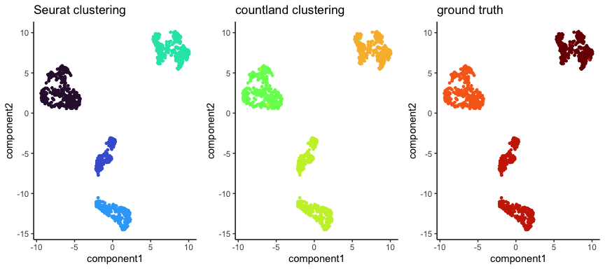

countland and Seurat
================

### Samuel H. Church

This vignette shows how `countland` can be used to perform the steps of
the standard data processing and clustering workflow from `Seurat`, as
listed in [this
tutorial](https://satijalab.org/seurat/articles/pbmc3k_tutorial.html).

Load the required packages

``` r
library(countland)
library(dplyr)
library(Seurat)
library(networkD3)
library(patchwork)
library(ggplot2)
theme_set(theme_classic())

set.seed(84095) # choose a random seed for reproducibility
```

## Get the data

Here we are using the Gold standard dataset from [Freytag *et
al*](10.12688/f1000research.15809.2), here’s a look at it before
filtering.

``` r
gold.data <- Seurat::Read10X(data.dir = "../data/Gold_Freytag2018")
```

``` r
C <- countland(gold.data,remove_empty=TRUE)
#> [1] "countland object"
#> [1] "after removing empty cells and genes,"
#> [1] "the count matrix has 29212 genes (rows)"
#> [1] "    and 925 cells (columns)"
#> [1] "the fraction of entries that are nonzero is 0.2905"
C@names_genes <- gsub("_","-",C@names_genes) # set names equal to Seurat
```

## Filter

The `Seurat` tutoral provides instructions on filtering cells, for
example cells with more than 200 unique gene observations and genes
observed in 3 cells. With `countland` it may not be necessary or helpful
to filter the data based on sparsity.

Here, for comparability, we demonstrate how we can filter cells and
genes to the same level as `Seurat` using `countland`.

``` r
gold <- CreateSeuratObject(counts = gold.data, project = "gold3k", min.cells = 3, min.features = 200)
gold
#> An object of class Seurat 
#> 24224 features across 925 samples within 1 assay 
#> Active assay: RNA (24224 features, 0 variable features)

C <- ScoreCells(C)
cell_filt <- C@cell_scores[C@cell_scores$n_features >= 200,]$names
C <- SubsetCells(C,which(C@names_cells %in% cell_filt),remove_empty=FALSE)
#> [1] "new number of genes: 29212"
#> [1] "new number of cells: 925"

C <- ScoreGenes(C,subsample=FALSE)
gene_filt <- C@gene_scores[C@gene_scores$n_cells >= 3,]$names
C <- SubsetGenes(C,which(C@names_genes %in% gene_filt),remove_empty=FALSE)
#> [1] "new number of genes: 24224"
#> [1] "new number of cells: 925"
```

The next step in a `Seurat` workflow is filtering on the fraction of
counts from mitochondrial genes, typically less than 5%. The same can be
accomplished with `countland`.

However, the Gold dataset does not contain gene names that are annotated
as mitochondrial. Here we demonstrate how countland can also be used to
score genes based on gene annotations, using regular expression
matching.

``` r
#check for number of counts from a specific gene, here ending with "271254"
gene_string <- "271254$"

C <- ScoreCells(C,gene_string)
head(C@cell_scores)
#>                      names n_features max_count_value total_counts
#> 1 H1975_AAAGATGCACATTTCT-1       8569            1010       100758
#> 2 H1975_AAAGATGTCCTTTACA-1       9185            1803       121196
#> 3 H1975_AAATGCCCACTTCGAA-1       8428            1097        95215
#> 4 H1975_AAATGCCTCATATCGG-1       8303            1678        99312
#> 5 H1975_AACACGTGTCAGAAGC-1       8631            1142       106587
#> 6 H1975_AACCATGAGCGTAGTG-1       7897            1549        90906
#>   n_features_above1 n_features_above10 unique_count_values count_index
#> 1              5746               1432                 227         127
#> 2              6316               1567                 245         137
#> 3              5643               1390                 219         127
#> 4              5555               1247                 221         131
#> 5              5833               1431                 231         133
#> 6              5057               1127                 214         128
#>   feature_match_counts
#> 1                    1
#> 2                    2
#> 3                    0
#> 4                    1
#> 5                    0
#> 6                    0
```

After filtering, both datasets have 24224 genes and 925 cells.

## Detect highly variable features

`Seurat` detects highly variable genes by calculating a form of mean and
variance using a dispersion estimate, and then filters the dataset to
the top 2,000 genes based on variance.

``` r
gold <- FindVariableFeatures(gold, selection.method = "vst", nfeatures = 2000)
```

`countland` calculates several count-based measures of gene expression,
including the number of unique count observations, and the count-index,
which is the largest number *n* where there are *n* cells with more than
*n* counts. To standardize sequencing depth before scoring genes, we can
subsample observations per cell to a fixed number.

``` r
C <- Subsample(C,cell_counts=40000)
#> [1] "subsampling all cells to a standard sequencing depth of 40000"
C <- ScoreGenes(C,subsample=TRUE)
head(C@gene_scores)
#>             names n_cells max_count_value total_counts n_cells_above1
#> 1 ENSG00000000003     595              10         1105            285
#> 2 ENSG00000000419     889              15         3535            771
#> 3 ENSG00000000457      97               2          103              6
#> 4 ENSG00000000460     218               4          271             40
#> 5 ENSG00000000971     164               4          215             42
#> 6 ENSG00000001036     859              11         2964            726
#>   n_cells_above10 unique_count_values count_index
#> 1               0                   9           6
#> 2              10                  14          10
#> 3               0                   2           2
#> 4               0                   4           3
#> 5               0                   4           3
#> 6               1                  11           9
```

However, in `countland`, we don’t recommend any default filtering scheme
based on expression variation. Here, strictly for comparability
downstream, we filter the `countland` dataset to the same exact genes as
those identified by `Seurat`.

``` r
C <- SubsetGenes(C,which(C@names_genes %in% gold@assays$RNA@var.features))
#> [1] "after subsetting and removing empty cells and genes,"
#> [1] "after removing empty cells and genes,"
#> [1] "new number of genes: 2000"
#> [1] "new number of cells: 925"
```

## Cluster cells

`Seurat` clusters the data by normalizing, rescaling, calculating
distances in PC space, and then clustering the neighborhood graph of
that distance matrix.

``` r
gold <- NormalizeData(gold)
all.genes <- rownames(gold)
gold <- ScaleData(gold, features = all.genes)
gold <- RunPCA(gold, features = VariableFeatures(object = gold), verbose=F)
gold <- FindNeighbors(gold, dims = 1:10)
gold <- FindClusters(gold, resolution = 0.05)
gold <- RunUMAP(gold, dims = 1:10)
#> Warning: The default method for RunUMAP has changed from calling Python UMAP via reticulate to the R-native UWOT using the cosine metric
#> To use Python UMAP via reticulate, set umap.method to 'umap-learn' and metric to 'correlation'
#> This message will be shown once per session
```

`countland` clusters by calculating dot products between cells, and then
embedding the graph laplacian of that similarity matrix.

``` r
C <- Dot(C)
C <- Embed(C)
C <- Cluster(C,n_clusters=3,n_components=5)
```

## Visualize results

Here we plot results using the UMAP embedding calculated in `Seurat`.

``` r
cl_s <- paste0("seurat_cluster:",gold@meta.data$seurat_clusters)
cl_r <- paste0("cell_label:",gold@meta.data$orig.ident)
cl_c <- paste0("countland_cluster:",as.character(C@cluster_labels))
values <- unique(c(cl_s,cl_c,cl_r))
color <- viridis::turbo(n=length(values))
names(color) <- values

u1 <- gold@reductions$umap@cell.embeddings[,1]
u2 <- gold@reductions$umap@cell.embeddings[,2]
gdf <- data.frame("component1" = u1, "component2" = u2, "real_label" = cl_r, "seurat_clusters" = cl_s, "countland_clusters" = cl_c)

g1 <- ggplot(gdf,aes(x = component1, y = component2, color = seurat_clusters)) + geom_point(size=1) + scale_color_manual(values=color) + theme("legend.position" = "none") + ggtitle("Seurat clustering")
g2 <- ggplot(gdf,aes(x = component1, y = component2, color = countland_clusters)) + geom_point(size=1) + scale_color_manual(values=color) + theme("legend.position" = "none") + ggtitle("countland clustering")
g3 <- ggplot(gdf,aes(x = component1, y = component2, color = real_label)) + geom_point(size=1) + scale_color_manual(values=color) + theme("legend.position" = "none") + ggtitle("ground truth")
gridExtra::grid.arrange(g1,g2,g3,ncol=3)
```



Here we visualize results using the spectral embedding calculated in
`countland`.

``` r
u1 <- C@embedding[,2]
u2 <- C@embedding[,3]
gdf <- data.frame("component1" = u1, "component2" = u2, "real_label" = cl_r, "seurat_clusters" = cl_s, "countland_clusters" = cl_c)

g1 <- ggplot(gdf,aes(x = component1, y = component2, color = seurat_clusters)) + geom_point(size=1) + scale_color_manual(values=color) + theme("legend.position" = "none") + ggtitle("Seurat clustering")
g2 <- ggplot(gdf,aes(x = component1, y = component2, color = countland_clusters)) + geom_point(size=1) + scale_color_manual(values=color) + theme("legend.position" = "none") + ggtitle("countland clustering")
g3 <- ggplot(gdf,aes(x = component1, y = component2, color = real_label)) + geom_point(size=1) + scale_color_manual(values=color) + theme("legend.position" = "none") + ggtitle("ground truth")
gridExtra::grid.arrange(g1,g2,g3,ncol=3)
```


Here we visualize the correspondence between the ground truth cell
labels and the results from each approach.

``` r
# first we calculate the correspondence between clusters
get_cluster_comb_df <- function(cl1,cl2){
  return(data.frame('source'=cl1,'target'=cl2) %>% group_by(source,target) %>% count())
}
r1 <- get_cluster_comb_df(cl_r,cl_c)
r2 <- get_cluster_comb_df(cl_s,cl_r)
r <- bind_rows(r1,r2)

# A connection data frame is a list of flows with intensity for each flow
links <- data.frame(
  source=r$source, 
  target=r$target, 
  value=r$n
  )
 
# From these flows we need to create a node data frame: it lists every entities involved in the flow
nodes <- data.frame(
  name=c(as.character(links$source), 
  as.character(links$target)) %>% unique()
)

# Here we set up the custom color scheme
my_color <- 'd3.scaleOrdinal() .domain(["seurat_cluster:0", "seurat_cluster:3", "seurat_cluster:2", "seurat_cluster:1", "countland_cluster:2", "countland_cluster:1", "countland_cluster:3", "cell_label:H2228", "cell_label:H1975", "cell_label:HCC827"]) .range(["#30123BFF",  "#4662D7FF",  "#36AAF9FF",  "#1AE4B6FF",  "#72FE5EFF",  "#C7EF34FF",  "#FABA39FF",  "#F66B19FF",  "#CB2A04FF",  "#7A0403FF"])'

# With networkD3, connection must be provided using id, not using real name like in the links dataframe.. So we need to reformat it.
links$IDsource <- match(links$source, nodes$name)-1 
links$IDtarget <- match(links$target, nodes$name)-1
 
# Make the Network
p_high <- sankeyNetwork(Links = links, Nodes = nodes,
              Source = "IDsource", Target = "IDtarget",
              Value = "value", NodeID = "name", 
              sinksRight=TRUE, colourScale = my_color)
p_high
#> PhantomJS not found. You can install it with webshot::install_phantomjs(). If it is installed, please make sure the phantomjs executable can be found via the PATH variable.
```

<div id="htmlwidget-64c59cedc3da88a756ef" style="width:384px;height:384px;" class="sankeyNetwork html-widget"></div>
<script type="application/json" data-for="htmlwidget-64c59cedc3da88a756ef">{"x":{"links":{"source":[0,0,1,1,2,2,3,4,4,5,6],"target":[7,8,7,9,9,8,1,0,2,0,0],"value":[327,1,2,313,1,281,315,1,282,191,136]},"nodes":{"name":["cell_label:H1975","cell_label:H2228","cell_label:HCC827","seurat_cluster:0","seurat_cluster:1","seurat_cluster:2","seurat_cluster:3","countland_cluster:1","countland_cluster:3","countland_cluster:2"],"group":["cell_label:H1975","cell_label:H2228","cell_label:HCC827","seurat_cluster:0","seurat_cluster:1","seurat_cluster:2","seurat_cluster:3","countland_cluster:1","countland_cluster:3","countland_cluster:2"]},"options":{"NodeID":"name","NodeGroup":"name","LinkGroup":null,"colourScale":"d3.scaleOrdinal() .domain([\"seurat_cluster:0\", \"seurat_cluster:3\", \"seurat_cluster:2\", \"seurat_cluster:1\", \"countland_cluster:2\", \"countland_cluster:1\", \"countland_cluster:3\", \"cell_label:H2228\", \"cell_label:H1975\", \"cell_label:HCC827\"]) .range([\"#30123BFF\",  \"#4662D7FF\",  \"#36AAF9FF\",  \"#1AE4B6FF\",  \"#72FE5EFF\",  \"#C7EF34FF\",  \"#FABA39FF\",  \"#F66B19FF\",  \"#CB2A04FF\",  \"#7A0403FF\"])","fontSize":7,"fontFamily":null,"nodeWidth":15,"nodePadding":10,"units":"","margin":{"top":null,"right":null,"bottom":null,"left":null},"iterations":32,"sinksRight":true}},"evals":[],"jsHooks":[]}</script>
